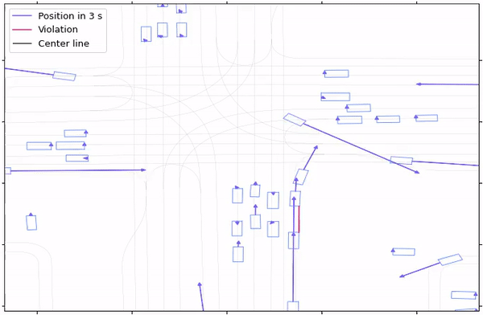
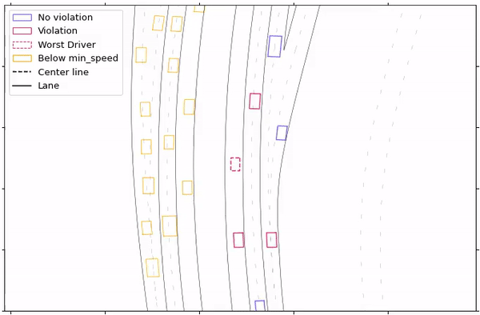

# Quantification of Actual Road User Behavior on the Basis of Given Traffic Rules

## Code and supplementary materials

Repository of the paper **[Quantification of Actual Road User Behavior on the Basis of Given Traffic Rules]()** at [IV 2022](https://iv2022.com/). I am a strong supporter of the [Public Money, Public Code](https://publiccode.eu/) idea and happy to contribute to it with this repository. 

It provides two scripts to extract and learn the robustness slackness of two traffic rules out of the [Waymo Open Dataset Motion](https://waymo.com/intl/en_us/dataset-motion/):

* Safety Distance
* Speed Limits

Each slack is a percentage, that indicates how strongly a rule is followed among every driver in the dataset.

Detailed description of the underlying rules [here](https://google.com/)

# Results of both rules:

<span style="font-size:larger;">

📋  Distance Keeping: μ=0.867 σ=0.2
 
<details>


  <summary>Statistics</summary>

</details>

<details>


  <summary>Settings</summary>

* latency = 3
* step_size = 10
* size = None
* save_detail = True
* min_speed = 5.0
* anlge_range = 20.0
</details>

</span>
<br/>

<span style="font-size:larger;">

📋 Speed Limitation: μ=0.967 σ=0.077

<details>


  <summary>Statistics</summary>

</details>

<details>
  <summary>Settings</summary>

* dist = 10.0
* step_size = 10
* size = None
* save_detail = True
* min_speed = 0.8
</details>
</span>
<br/>

# Install Repository
Install inside of a virtual environment (recommended)
```bash
pip install --upgrade pip
git clone https://github.com/daniel-bogdoll/actual_road_user_behavior.git
pip install -r requirements.txt
```
# Distance Keeping
For extracting the distance slack run:
```bash
cd scripts
python DistanceRule.py --path path/to/dataset
```
which provides follwoing flags:

|Flag|Description|Default|
|---|---|---|
|--path|Path to [dataset](https://console.cloud.google.com/storage/browser/waymo_open_dataset_motion_v_1_0_0/uncompressed/scenario?pageState=(%22StorageObjectListTable%22:(%22f%22:%22%255B%255D%22))&prefix=&forceOnObjectsSortingFiltering=false)|data/dataset/|
|--latency|Time of latency for the three-second rule|3|
|--step_size|Extract every [number]th state|10|
|--min_speed|Ignore drivers below this threshold|5.0|
|--angle_range|Prevent rule violation of a driver that <br/> is not facing an other vehicle among (+/-)<br/> [angle_range] (degree). Prevents violation in curves.|10|
|--size| Extract only a certain amount of files|None (=all files)|
|--save_freq| Update and save overall file|100|
|--save_detail| If True, save every state and the average file of all scenarios|True|
|--sample| If True, plot a random scenario with visualizations|False|

Visualization of a random file among the dataset:



# Speed Limitation
For extracting the Speed Limit slack run:
```bash
cd scripts
python VelocityRule.py --path path/to/dataset
```
which provides follwoing flags:

|Flag|Description|Default|
|---|---|---|
|--path|Path to [dataset](https://console.cloud.google.com/storage/browser/waymo_open_dataset_motion_v_1_0_0/uncompressed/scenario?pageState=(%22StorageObjectListTable%22:(%22f%22:%22%255B%255D%22))&prefix=&forceOnObjectsSortingFiltering=false)|data/dataset/|
|--dist|Maximum distance between driver and closest lane_center|10.0|
|--step_size|Extract every [number]th state|10|
|--min_speed|Percentage of the assigned speed limit. Discard drivers below this threshold|0.8|
|--size| Extract only a certain amount of files|None (=all files)|
|--save_freq| Update and save overall file|100|
|--save_detail| If True, save every state and the average file of all scenarios|True|
|--sample| If True, plot a random scenario with visualizations|False|

Visualization of a random file among the dataset:



<br/>

# Citation

If you are using this Rule extractor for scientific research, we would be pleased if you would cite our [publication](http://google.com/):

```latex
@inproceedings{Rule extractor,
  title     = {{Quantification} {of} {Actual} {Road} {User} {Behavior} {on} {the} {Basis} {of} {Given} {Traffic} {Rules}},
  author    = {Moritz Nekolla and Daniel Bogdoll},
  year      = {2021},
  Url={http://google.com/}
}
```
